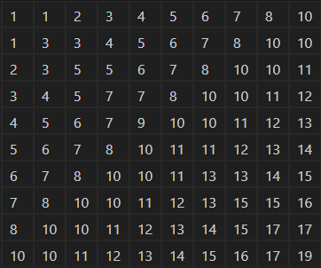
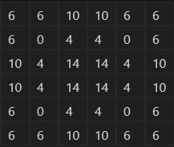
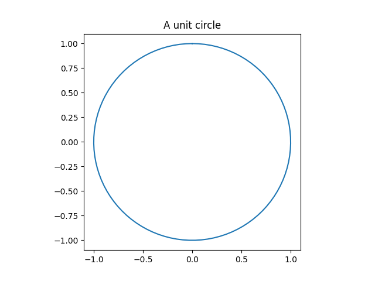
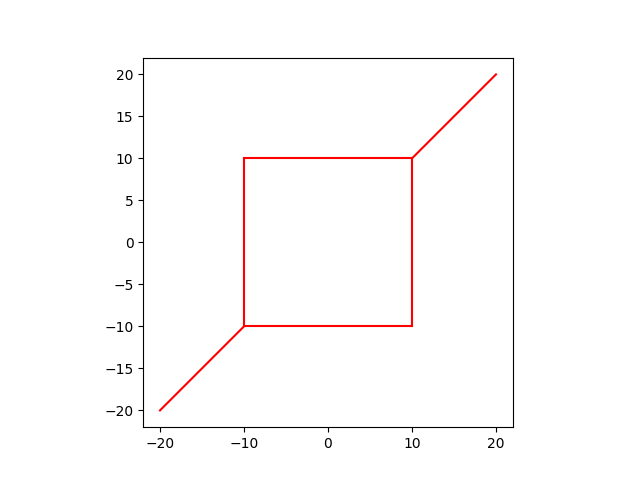
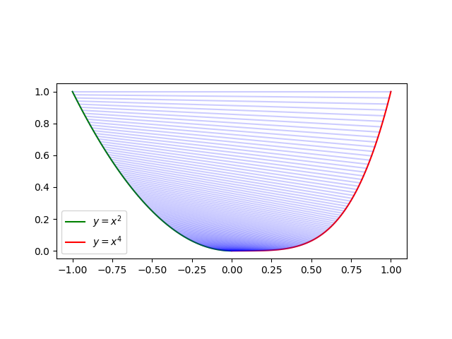

# Homework No. 06

**Due:** 23:59, 22 December, 2023

**Max points:** 100

## Rules

- **No late homeworks.** A penalty of 10 points is applied for each day.
- **No plagiarism.** Collaboration is encouraged, but copying someone else's work without proper attribution is not admitted and invalidates the submission. A penalty is applied to all parties included.

## Submission procedure

- Each problem solution should be saved in a separate file. The following naming convention should be used: `problem{number}.{extension}`. For example, `problem1.py` or `problem1.pdf`.
- At the start of each file, homework number, student full name and problem number should be mentioned. For example:

```python
"""
Homework 6
Name: John Doe
Problem 1
"""
```

- Solution files should be uploaded to [YSU Moodle](https://e-learning.ysu.am/). Alternatively, you can commit your solutions to a Git repository and provide the repository URL on Moodle.

<div style="page-break-after: always;"></div>

## Problem 1: Build the following numpy arrays [50 points]
### 1.1 [30 points]

### 1.2 [20 points]


<div style="page-break-after: always;"></div>

## Problem 2: Replicate given plots [50 points]
### 2.1 [15 points]

<div style="page-break-after: always;"></div>

### 2.2 [15 points]

<div style="page-break-after: always;"></div>

### 2.3 [20 points]


<script type="text/javascript" src="http://cdn.mathjax.org/mathjax/latest/MathJax.js?config=TeX-AMS-MML_HTMLorMML"></script>
<script type="text/x-mathjax-config">
    MathJax.Hub.Config({ tex2jax: {inlineMath: [['$', '$']]}, messageStyle: "none" });
</script>